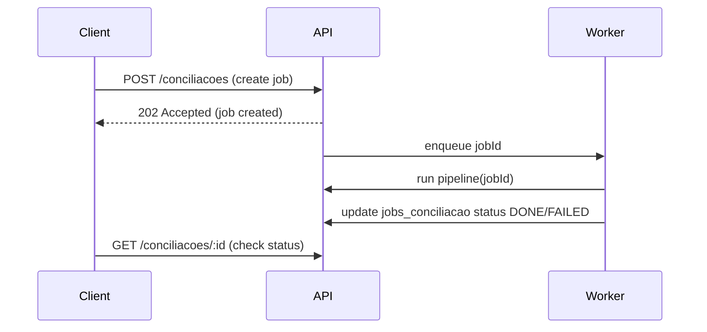

# AL-Tool — Conciliação Contábil × Fiscal

## Sumário
- Arquitetura
- Modelo de Domínio
- Pipeline (steps)
- Endpoints da API (referência)
- Exemplos de uso (fluxos completos)
- Considerações de Performance
- Referência Rápida

---

# 1. Visão Geral do Sistema
## Objetivo
Automatizar a conciliação entre uma **BASE A (CONTÁBIL)** e uma **BASE B (FISCAL)**:
- Receber arquivos (Excel)
- Rodar uma pipeline de regras (nulos, estorno, cancelamento, conciliação)
- Persistir resultados por job e permitir exportação para XLSX

- **BASE A (CONTÁBIL)**: representações de lançamentos contábeis (razão, débitos/créditos, montantes).
- **BASE B (FISCAL)**: registros fiscais (notas fiscais, valores, indicadores de cancelamento).

## O que é uma conciliação

## Fluxo macro
2. Ingestão para SQLite (`POST /bases/:id/ingest`)
3. Pipeline de processamento (vários steps)
4. Execução por job (`POST /conciliacoes`)

---


Monorepo com os workspaces:

- `apps/api` — API REST (Express, TypeScript). Contém rotas, serviços, DB (knex) e storage.
- `packages/pipeline` — engine da pipeline: `PipelineContext`, `PipelineStep`, e steps implementados.
- `packages/domain` — (tipos / domínio) placeholder.
- `packages/shared` — (utilitários) placeholder.
### SQLite
- Banco local em arquivo: `apps/api/db/dev.sqlite3`.
- Cada base ingerida vira uma tabela: `base_{id}`.
PRAGMAs aplicados em `apps/api/src/db/knex.ts` no startup (com overrides por env vars):

- `journal_mode = WAL` — melhora concorrência leitura/escrita em operações de bulk.
- `synchronous = NORMAL` — trade-off entre durabilidade e desempenho.
- `cache_size = -2000` — páginas mantidas em RAM (negativo = número de páginas).
- `temp_store = MEMORY` — armazenar temporários em memória.
- `busy_timeout = 5000` ms — evitar `SQLITE_BUSY` em cargas concorrentes.

Variáveis de ambiente para ajuste: `SQLITE_JOURNAL_MODE`, `SQLITE_SYNCHRONOUS`, `SQLITE_CACHE_SIZE`, `SQLITE_TEMP_STORE`, `SQLITE_BUSY_TIMEOUT`.

### Storage
- Uploads e arquivos salvos por padrão em: `apps/api/storage/uploads`.
- Exports (XLSX) também são salvos via `FileStorage` (padrão no mesmo diretório).

---

# 3. Modelo de Domínio

## 3.1 Base (dataset)
- Tabela: `bases`
- Campos: `id`, `tipo` (`CONTABIL` | `FISCAL`), `nome`, `periodo`, `arquivo_caminho`, `tabela_sqlite`, `created_at`, `updated_at`.
- Arquivos físicos: `apps/api/storage/uploads`.
- Tabelas SQLite: `base_{id}` criadas pela ingestão, colunas inferidas do cabeçalho do Excel.

## 3.2 Configurações

### ConfigCancelamento (`configs_cancelamento`)
- Campos: `id`, `base_id`, `nome`, `coluna_indicador`, `valor_cancelado`, `valor_nao_cancelado`, `ativa`, timestamps.
- `coluna_indicador`: coluna na BASE B que identifica cancelamento.

### ConfigEstorno (`configs_estorno`)
- Campos: `id`, `base_id`, `nome`, `coluna_a`, `coluna_b`, `coluna_soma`, `limite_zero`, `ativa`, timestamps.
- Conceito: pares de linhas na BASE A que somam ~0 na `coluna_soma` são considerados estorno.

### ConfigConciliacao (`configs_conciliacao`)
- Campos: `id`, `nome`, `base_contabil_id`, `base_fiscal_id`, `chaves_contabil` (JSON), `chaves_fiscal` (JSON), `coluna_conciliacao_contabil`, `coluna_conciliacao_fiscal`, `inverter_sinal_fiscal`, `limite_diferenca_imaterial`, timestamps.
- `chaves_contabil` / `chaves_fiscal`: arrays com nomes das colunas usadas para match.

## 3.3 JobConciliacao (`jobs_conciliacao`)
- Campos: `id`, `nome`, `config_conciliacao_id`, `config_estorno_id`, `config_cancelamento_id`, `status` (`PENDING` | `RUNNING` | `DONE` | `FAILED`), `erro`, `arquivo_exportado`, timestamps.
- A pipeline executa com `PipelineContext` contendo `jobId`, `baseContabilId`, `baseFiscalId`, `configConciliacaoId`, etc.

---

# 4. Pipeline (steps)

Pipeline é uma sequência de `PipelineStep`s. Cada step opera no DB e/ou cria marcações.

## Steps implementados

### 4.1 NullsBaseAStep
- **O que faz:** normaliza nulos/valores vazios na BASE A.
- **Entrada:** `base_{A}` e config de conciliação.
- **Saída:** valores normalizados (UPDATE em tabela A).

### 4.2 NullsBaseBStep
- Mesma função para BASE B.

### 4.3 EstornoBaseAStep
- **O que faz:** encontra pares A×A que se anulam segundo `configs_estorno`.
- **Entrada:** `base_{A}`, `configs_estorno`.
- **Saída:** inserções na tabela auxiliar `conciliacao_marks` com `grupo='Conciliado_Estorno'`.

### 4.4 CancelamentoBaseBStep
- **O que faz:** marca NFs canceladas na BASE B segundo `configs_cancelamento`.
- **Entrada:** `base_{B}`, `configs_cancelamento`.
- **Saída:** inserções na `conciliacao_marks` com `grupo='NF Cancelada'`.

### 4.5 ConciliacaoABStep
- **O que faz:** executa JOIN A→B usando `chaves_contabil`/`chaves_fiscal`, calcula `value_a`, `value_b`, aplica `inverter_sinal_fiscal`, calcula `difference` e classifica o resultado.
- **Entrada:** `base_{A}`, `base_{B}`, `configs_conciliacao`, `conciliacao_marks`.
- **Saída:** tabela `conciliacao_result_{jobId}` com colunas: `id, job_id, chave, status, grupo, a_row_id, b_row_id, a_values, b_values, value_a, value_b, difference, created_at`.

### 4.6 Export Service
- Lê `conciliacao_result_{jobId}` e gera XLSX via `xlsx`, salva via `FileStorage`, atualiza `jobs_conciliacao.arquivo_exportado`.

---

# 5. Endpoints da API (referência técnica)

Todos os endpoints são expostos pela API em `apps/api/src/routes`.

> Aqui listamos os endpoints principais com exemplos resumidos. Consulte a API diretamente para obter respostas reais.

## Bases

- `POST /bases` — Upload de Excel (multipart/form-data `file`) e registro da base.
- `POST /bases/:id/ingest` — Ingestão do arquivo para `base_{id}`.
- `GET /bases` — Listar bases.
- `GET /bases/:id` — Detalhe base (inclui `tabela_sqlite` e `rowCount` quando disponível).
- `GET /bases/:id/preview` — Pré-visualização (colunas + primeiras linhas).

## Configurações — Cancelamento

- `POST /configs/cancelamento` — Criar.
- `GET /configs/cancelamento` — Listar.
- `GET /configs/cancelamento/:id` — Detalhar.
- `PUT /configs/cancelamento/:id` — Atualizar.
- `DELETE /configs/cancelamento/:id` — Deletar.

## Configurações — Estorno

- `POST /configs/estorno` — Criar (indexes em `coluna_a`/`coluna_b` criados quando possível).
- `GET /configs/estorno` — Listar.
- `GET /configs/estorno/:id` — Detalhar.
- `PUT /configs/estorno/:id` — Atualizar.
- `DELETE /configs/estorno/:id` — Deletar.

## Configurações — Conciliação

- `POST /configs/conciliacao` — Criar (índices nas colunas de chaves serão criados quando possível).
- `GET /configs/conciliacao` — Listar.
- `GET /configs/conciliacao/:id` — Detalhar.
- `PUT /configs/conciliacao/:id` — Atualizar.
- `DELETE /configs/conciliacao/:id` — Deletar.

## Conciliações (Jobs)

- `POST /conciliacoes` — Criar e executar job (atualmente execução síncrona; recomendado usar worker para jobs longos).
- `GET /conciliacoes` — Listar jobs.
- `GET /conciliacoes/:id` — Job + métricas (totalRows, byStatus, byGroup).
- `GET /conciliacoes/:id/resultado` — Resultado paginado da `conciliacao_result_{jobId}` (`page`, `pageSize`).
- `POST /conciliacoes/:id/exportar` — Gera XLSX (se não existir) e retorna `{ path, filename }`.
- `GET /conciliacoes/:id/download` — Faz download do XLSX se existir.

---

# 6. Exemplos completos de uso da API

### Fluxo 1 — Ingestão

1. `POST /bases` (upload)
2. `POST /bases/:id/ingest` (converte para `base_{id}`)
3. `GET /bases/:id/preview` (visualizar primeiras linhas)

### Fluxo 2 — Configurações

1. `POST /configs/estorno` (criar regra de estorno)
2. `POST /configs/cancelamento` (criar regra de cancelamento)
3. `POST /configs/conciliacao` (criar regra de conciliação)

### Fluxo 3 — Conciliação

1. `POST /conciliacoes` (cria e executa job)
2. `GET /conciliacoes/:id` (verifica status e métricas)
3. `GET /conciliacoes/:id/resultado` (acompanha resultados paginados)

### Fluxo 4 — Exportação

1. `POST /conciliacoes/:id/exportar` (gera e salva XLSX)
2. `GET /conciliacoes/:id/download` (baixa o arquivo)

Em todos os fluxos, as respostas JSON seguem os exemplos mostrados na documentação da API (veja seção 5).

---

# 7. Diagramas (Mermaid)

## Pipeline completa

```mermaid
flowchart LR
  U[Upload arquivo] --> I[Ingestão -> base_{id}]
  I --> N1[NullsBaseAStep]
  N1 --> E[EstornoBaseAStep]
  E --> N2[NullsBaseBStep]
  N2 --> C[CancelamentoBaseBStep]
  C --> X[ConciliacaoABStep]
  X --> R[conciliacao_result_{jobId}]
  R --> EX[Export Service -> XLSX]
```

## Fluxo de criação de job (assíncrono recomendado)



## Fluxo de ingestão (chunking)

```mermaid
flowchart LR
  F[Excel File] --> P[Read header]
  P --> T[Create table base_{id}]
  P --> CH[Stream rows in chunks]
  CH -->|batch nrows| I[Insert batch into SQLite]
  I --> CH
  CH --> E[End - update base.tabela_sqlite]
```

---

# 8. Considerações sobre Performance

## Ingestão
- Batched inserts (`INGEST_BATCH_SIZE`, default 1000) para reduzir overhead de I/O.
- Recomenda-se streaming (`exceljs` WorkbookReader) para 100k–1M+ linhas sem alocar `dataRows` em memória.

## Índices
- Índices criados dinamicamente (helper `indexHelpers`) com nomes `idx_base_{baseId}_{column}` para colunas usadas em chaves, estorno e cancelamento.
- Queries de join e filtros beneficiam-se claramente — observe `EXPLAIN QUERY PLAN` para confirmar uso.

## PRAGMAs
- `WAL`, `synchronous=NORMAL`, `cache_size=-2000`, `temp_store=MEMORY`, `busy_timeout=5000` como defaults equilibrados.

## Execução assíncrona
- Transformar execução de jobs para worker/queue evitará timeouts e permitirá escalabilidade.

---

# Referência Rápida

- DB file: `apps/api/db/dev.sqlite3`
- Uploads: `apps/api/storage/uploads`
- Ingest batch env: `INGEST_BATCH_SIZE`
- PRAGMA env: `SQLITE_JOURNAL_MODE`, `SQLITE_SYNCHRONOUS`, `SQLITE_CACHE_SIZE`, `SQLITE_TEMP_STORE`, `SQLITE_BUSY_TIMEOUT`
- Job results table: `conciliacao_result_{jobId}`
- Marks table: `conciliacao_marks`

---

## Próximos passos recomendados
- Implementar execução assíncrona de jobs (worker + queue).
- Implementar ingestão streaming com `exceljs` para arquivos muito grandes.
- Adicionar scripts de benchmark / geração de arquivos de teste.

---

Se quiser, comito também um `CONTRIBUTING.md` e scripts de benchmark — diga qual recurso prefere que eu implemente primeiro.
